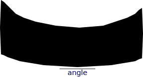

# Umriss

Traces black-and-white bitmaps into SVG.

> :warning: The project is currently under development.

While _Umriss_ can be used for tracing graphics, its main orientation is scanned documents and books.
It generates compact SVG files which, after compressing into SVGZ, are comparable in size to the traditional bitmap formats or even smaller.
Some planned features, such as glyph reusing **(TODO)**, can reduce the size even further.

_Umriss_ uses several tracing methods, both lossless and lossy.

## Usage

**(TODO)**

A CLI is not yet implemented. Edit the `__main__.py` file to change settings.

Before tracing, the input bitmap is binarized using the simplest threshold method.
For better quality, consider binarizing the image beforehand using a more advanced binarization method.
For scans, [_ScanTailor_](https://scantailor.org) or [_ScanTailor Advanced_](https://github.com/4lex4/scantailor-advanced) would be great choices.

The code is not optimized yet. Execution can take quite a few seconds on a single image.

## Tracing methods

### `Exact`

Creates an exact contour around the black pixels of the image.

The file sizes can even be smaller than those of lossily approximating methods due to using `h` and `v` SVG node types with integer relative coordinates.

### `AccuratePolygon`

Approximates a pixel contour with a polygon.

The resulting contour, when rasterized again into a black-and-white bitmap, should match the original bitmap.
So, this tracing method can be considered lossless.

Maximum [Hausdorff distance](https://en.wikipedia.org/wiki/Hausdorff_distance) between the original and the result contours is 0.5 px.

Preserves the symmetries of the original image.

_Parameters:_
- `max_slope_ratio` (positive integer, default value: `10`)
  
  Defines maximum slope ratio. E.g. if the value is 10, then 10 px by 1 px stepped line will be considered a slope while 11 or more by 1 will be considered horizontal/vertical. Higher values give smoother contours, but if the value is too high, there won't be any horizontal or vertical line in the image.
  
  | original | `max_slope_ratio = 2` |
  |:--------:|:---------------------:|
  |  |  |
  | **`max_slope_ratio = 10`** | **`max_slope_ratio = 18`** |
  |  |  |

- `corner_offset` (range: `0.0..0.25`, default value: `0.25`)

  Makes the contours smoother by offsetting sharp corners. On the other hand, makes some small details look worse.
  Values greater than 0.25 are not supported because of possible losslessness violation.
  
  | `corner_offset = 0` | `corner_offset = 0.25` |
  |:-------------------:|:----------------------:|
  |  |  |

### `DouglasPeuckerPolygon`

Approximates contours with polygons using the Douglas—Peucker algorithm from _OpenCV_.

The maximum Hausdorff distance between the original and the result can be specified.

The algorithm does not create any new points. It only drops some points of the input contour.

_Parameters:_
- `max_distance` (positive, default value: `1.0`)

- `preliminary_approximation` (optional, default value: `None`)
  
  A polygonal approximation that is used before the Douglas—Peucker approximation.

preliminary approximation | `max_distance = 0.5` | `max_distance = 1` | `max_distance = 2` |
---------------------------:|:--------------------:|:------------------:|:------------------:|
`None` |  |  |  |
`AccuratePolygon` |  |  |  |

### `Quadratic`

**(TODO)**

Approximates the contours with quadratic Bézier splines so that the distance between the spline and the original contour never exceeds the given maximum value. Tries to minimize node count.

### `SillyCubic`

**(For test purposes only. Results can be pretty terrible.)**

Applies a given polygonal approximation first.
Then, draws a smooth cubic spline between the even points of the polygon.
The odd ones are used for tangents in a not-so-clever way.

_Parameters:_
- `polygonal_approximation`
  
  An approximation used before the cubic approximation.
  
  | `polygonal_approximation = AccuratePolygon` | `polygonal_approximation = DouglasPeuckerPolygon(1)` |
  |:-----------------:|:-----------------------:|
  |  |  |

## File size comparison

Here are some examples of traced sccanned pages and their sizes.

| File type | Page 1 | Page 2 | Page 3 |
|:----------|-------:|-------:|-------:|
| png (1 bit per pixel) | [339 kB](images/page1/page1-bw.png) | [365 kB](images/page2/page2-bw.png) | [567 kB](images/page3/page3-bw.png) |
| tiff (CCITT Group 4) | [160 kB](images/page1/page1-ccitt4.tif) | [156 kB](images/page2/page2-ccitt4.tif) | [206 kB](images/page3/page3-ccitt4.tif) |
| svg/svgz Exact | [1088](images/page1/page1-exact.svg) / [171 kB](images/page1/page1-exact.svgz)| [1162](images/page2/page2-exact.svg) / [180 kB](images/page2/page2-exact.svgz) | [1377](images/page3/page3-exact.svg) / [197 kB](images/page3/page3-exact.svgz) |
| svg/svgz AccuratePolygon | [1289](images/page1/page1-accurate.svg) / [243 kB](images/page1/page1-accurate.svgz) | [1370](images/page2/page2-accurate.svg) / [258 kB](images/page2/page2-accurate.svgz) | [1302](images/page3/page3-accurate.svg) / [259 kB](images/page3/page3-accurate.svgz) |
| svg/svgz DouglasPeucker(1) | [551](images/page1/page1-dp-1.svg) / [173 kB](images/page1/page1-dp-1.svgz) | [603](images/page2/page2-dp-1.svg) / [188 kB](images/page2/page2-dp-1.svgz) |[445](images/page3/page3-dp-1.svg) / [156 kB](images/page3/page3-dp-1.svgz) |

